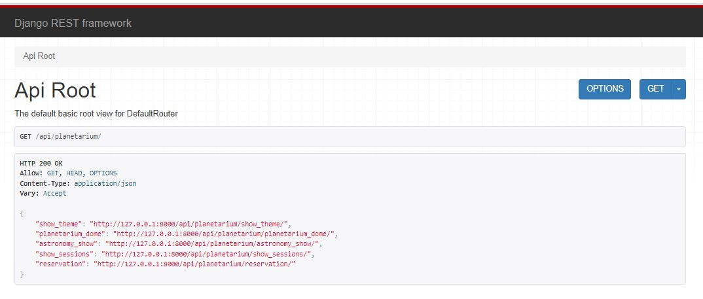
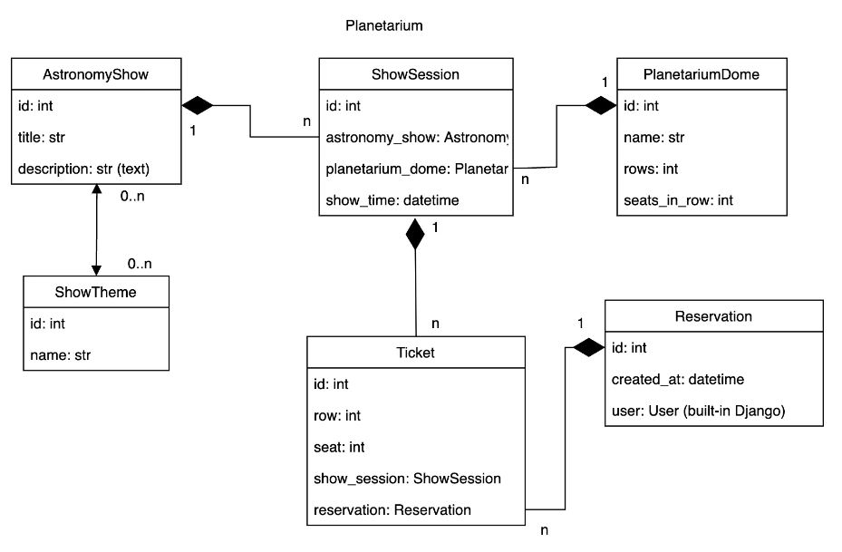
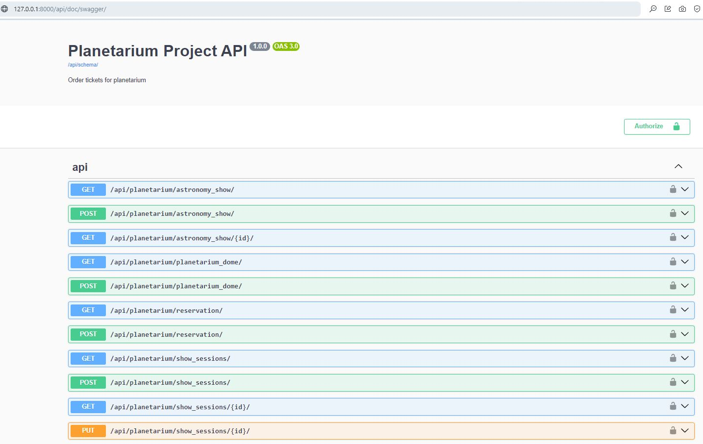
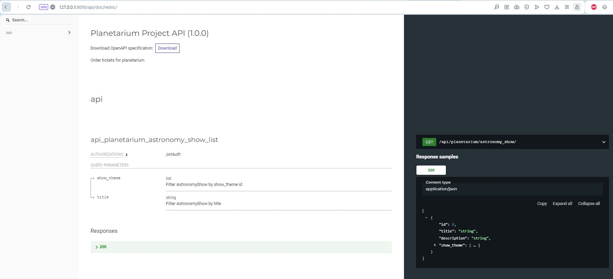

## Planetarium api-service

Django Rest Framework project for managing Planetarium Service.

## Features

- Creating orders by authenticated users
- View Astronomy show list and detail information for authenticated users
- Filtering Astronomy show by title, show theme for authenticated users
- Creating Astronomy show, Planetarium Dome, Show theme by admin
- Documentation at /api/doc/swagger
- Pagination for reservation list

## Install via GitHub

Python3 must be already installed
```shell
    git clone https://github.com/lgSilay/planetarium-api-service.git
    cd planetarium_api
    python -m venv venv
    source venv/bin/activate # or venv\Scripts\activate in Windows
    pip install -r requirements.txt
    python manage.py migrate
    python manage.py createsuperuser
    python manage.py runserver
```

## Available urls
- api/planetarium/show_theme
- api/planetarium/planetarium_dome
- api/planetarium/astronomy_show
- api/planetarium/show_sessions
- api/planetarium/reservation

#### JWT endpoints:
- create user:
  - api/user/register
- get access token:
  - api/user/token
- verify access token:
  - api/user/token/verify
- refresh token:
  - api/user/token/refresh
- manage user:
  - api/user/me

## API Root


## DB structure


## Swagger documentation


## Redoc documentation

